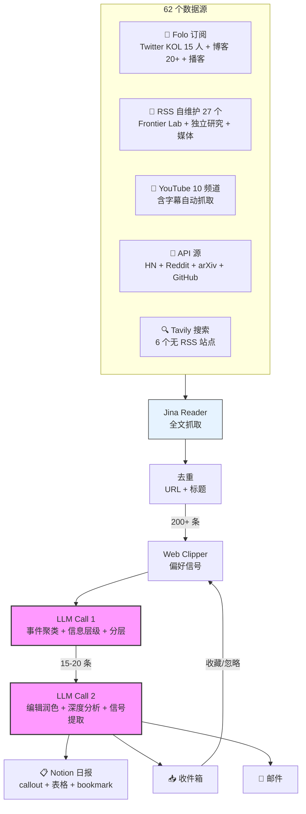
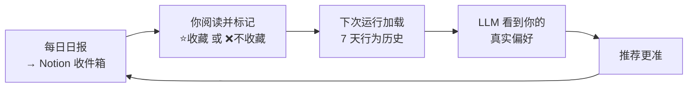

# AI Daily Digest — 62 个数据源喂给 AI，每天从 200 篇里挑出真正重要的 15 条

> **AI 应用洞察 · 每天 08:00**
>
> 全面、实时、有重点。这是我给自己搭的 AI 情报系统的三条设计原则。


---

## 为什么要搭这个

先说个真实场景——

早上打开 Folo，60 条未读。切到 Twitter，刷了 20 分钟。再看看 HN、Reddit、量子位……一个半小时过去了。

记住了多少？可能三条。而且你也不确定，有没有漏掉什么重要的。

**我不需要更多信息，我需要更快知道什么变了。**

---

## 完整 Pipeline

```
62 个源并发抓取
  → Jina Reader 全文解析
  → URL + 标题去重
  → LLM Call 1（事件聚类 + 信息层级判断 + 分层筛选）
  → LLM Call 2（结构化编辑 + 深度分析 + 信号提取）
  → 输出到 Notion 日报（callout + 表格 + 信号）+ 收件箱 + 邮件推送
```

整个流程全自动，每天定时跑。我只在最后花 30 分钟做人工审核，加入自己的产品判断。



---

## 数据源：抓得全是一切的基础

### 🔵 官方一手源（15 个）

OpenAI · Anthropic · Google DeepMind · Microsoft Research · Apple ML · Meta AI · Mistral · NVIDIA · HuggingFace + a16z · Sequoia Capital

→ 官方博客和公告直接通过 RSS 订阅，不等任何媒体转述，第一时间进系统

### 🟣 顶级独立研究 & 深度博客（15 个）

Stratechery (Ben Thompson) · Semianalysis · Simon Willison · Lilian Weng · Import AI (Jack Clark) · Zvi Mowshowitz · Interconnects (Nathan Lambert) · ChinAI (Jeff Ding) · Ahead of AI (Raschka) · Benedict Evans · Exponential View · Gary Marcus · AI Snake Oil · LangChain Blog · Turing Post

→ 这些不是新闻，是判断。全文通过 Jina Reader 自动抓取，不只是标题和摘要

### 🟢 社区一线（4 个）

- **Hacker News** — 全量热帖 + Jina Reader 抓全文
- **Reddit** — r/LocalLLaMA + r/MachineLearning 热帖 + 链接全文
- **GitHub Trending** — Python 每日热门项目 + README 摘要
- **arXiv** — cs.AI / cs.CL / cs.LG 最新论文

→ 一个开源项目在 GitHub 上 1000 星的时候，媒体可能还没报道。比传统媒体早 12-48 小时

### 🟠 播客 & YouTube（10 个频道）

No Priors (a16z) · Andrej Karpathy · Lex Fridman · Fireship · Dwarkesh Patel · All-In Podcast · Two Minute Papers · Yannic Kilcher · AI Explained

→ 自动抓字幕，LLM 生成结构化深度摘要：核心观点 + 战略含义 + 关键引用 + 值得追踪的信号。一小时视频，5 分钟读完

### 👤 Twitter / X KOL（15 人）

Sam Altman · Karpathy · Yann LeCun · Elon Musk · Elad Gil · Jim Fan · Nathan Lambert · Swyx · Chip Huyen · Kevin Weil (OpenAI CPO) · Geoffrey Hinton · Andrew Ng · 宝玉xp · 归藏 · 小互

→ 创始人、研究者、投资人的一手表态。这些人说一句话，可能比一篇报道信息量更大

### 📰 中英文媒体（6 个）

36氪 · 量子位 · InfoQ 中文 · Ars Technica · MIT Technology Review · Semafor

### 🔍 无 RSS 站点 — 搜索引擎定向补漏（6 个站点）

anthropic.com · deepseek.com · epochai.org · menlovc.com · metr.org · lmarena.ai

→ 通过 Tavily API 定向搜索，没有 RSS 不代表不重要

**62 个独立源，每天 200+ 篇并发进来。**

---

## LLM 怎么筛：编辑级判断，不是翻译

大部分"AI 日报"的做法是：每篇文章丢给 GPT 写个摘要，然后罗列出来。这不叫筛选，这叫翻译。

我的系统做的是另一件事：**把 200 篇当作一个完整的信息场，做编辑级别的判断。**

### 第一步：事件聚类 + 信息层级分类

同一件事可能 5 个源都在报道。系统不是简单去重，而是按信息层级排序：

| 层级 | 定义 | 处理方式 |
|------|------|---------|
| **A 层** | 一手信息（创始人原推 / 官方公告 / 原始论文） | 几乎全选 |
| **B 层** | 深度分析（有原创观点的战略判断） | 选最好的几篇 |
| **C 层** | 二手报道（媒体转述，信息没有增量） | 同一事件只留一条 |
| **D 层** | 社区讨论 | 有独特见解才选 |
| **E 层** | 教程/消费内容 | 不选 |

**举个例子：** OpenAI 发新模型 → 留 Sam Altman 的推文（A 层）→ 留 Simon Willison 的深度分析（B 层）→ 丢掉 TechCrunch 的转述（C 层）→ 丢掉"让我们来看看"的教程（E 层）

### 第二步：分层输出

- 🔥 **头条**（3 条）→ 200-300 字深度分析，带态度、带判断、带来源表格
- 🔍 **值得关注**（5 条）→ 一段摘要 + 💡 洞察 callout
- ⚡ **速览**（8 条）→ 来源 + 动态表格，一眼扫完

### 第三步：信号提取

每期日报结尾有 **📡 趋势信号追踪** — 不是"AI 很火"这种废话，而是：

- 哪个具体方向在密集升温
- 哪些技术路线在降温
- 哪些变化值得你现在开始关注

每条洞察只回答一个问题：**「读完这条，我该更新什么判断？」**

---

## Notion 日报效果

日报使用 Notion API 原生 block 类型构建，视觉效果远超 markdown 平铺：

- 🤖 Page icon + 封面图
- 📊 蓝色 callout — 统计概览（扫描 200 篇 → 聚合 45 事件 → 精选 15 条）
- 📡 黄色 callout — 今日主线一句话
- 📰 头条区 — 深度分析 + **3 列来源表格**（带彩色 emoji 分类）+ bookmark 预览
- 💡 黄色 callout — 洞察（值得关注区）
- ⚡ 速览 — **2 列表格**（来源 / 动态）
- 📡 信号列表 — bold 关键词 + 一句话解释
- 📊 蓝色 callout — 底部统计

---

## 反馈闭环：越用越准



- ✅ **收藏** = 正样本 → 推更多类似内容
- ❌ **不收藏** = 负样本 → 减少类似内容
- ⭐ **标记「待深度阅读」** = 最强信号 → 系统学到你最看重什么

用得越多越准。

---

## Deep Reader：一小时视频，5 分钟读完

对 Notion 中的 YouTube 视频勾选「待深度阅读」→ 自动抓取完整字幕 → LLM 生成结构化摘要：

- **核心观点**（3-5 条）— 视频中最重要的判断/预测/数据
- **战略含义**（2-3 段）— 对 AI 产业竞争格局意味什么
- **关键引用**（2-3 条）— 原文中最有信息量的直接引用
- **值得追踪** — 未来几周应该关注什么信号

| 触发方式 | 命令 | 场景 |
|----------|------|------|
| **Pipeline 内置** | `python main.py` | 每次跑日报自动处理（Phase 7） |
| **CLI** | `python main.py --deep-read-only` | 按需处理 |
| **Webhook** | Notion Automation 触发 | 实时 |

---

## 快速开始

```bash
# 1. 安装
pip install -r requirements.txt

# 2. 配置环境变量
cp .env.example .env
# 填入: OPENAI_API_KEY, OPENAI_BASE_URL, NOTION_TOKEN, FOLO_SESSION_TOKEN

# 3. 运行
python main.py --skip-email

# 4. 查看产出
# → Notion 日报页面（带 callout + 表格 + 信号）
# → Notion 收件箱（分类条目）
# → output/YYYY-MM-DD/data.json
```

### 命令行选项

```bash
python main.py                                    # 完整管线（2 次 LLM 调用 + Langfuse 监控）
python main.py --skip-email --skip-notion         # 仅本地输出
python main.py --sources hackernews,arxiv,rss     # 指定数据源
python main.py --interests "AI Agent, SaaS"       # 覆盖兴趣配置
python main.py --cleanup-only                     # 仅清理收件箱
python main.py --deep-read-only                   # 仅运行 Deep Reader
```

---

## 和你现在用的信息流工具比

| | 传统 RSS 聚合 | AI 日报产品 | 本系统 |
|---|---|---|---|
| **筛选** | 无 | 单篇摘要 | LLM 编辑级判断 + 事件聚类 |
| **全文** | 仅标题/摘要 | 不确定 | Jina Reader 自动抓全文 |
| **播客/视频** | 不支持 | 不支持 | 自动转文字 + 深度摘要 |
| **立场** | 无 | 中性 | 产品/战略/投资视角 |
| **反馈** | 无 | 无 | 收藏行为实时反馈 |
| **来源链接** | 有 | 部分 | 全部保留，一键直达一手材料 |

---

## 项目结构

```
RSS-Notion/
├── main.py                    # 管线编排 + CLI 入口
├── config.json                # 数据源/LLM/调度配置
├── sources.yaml               # 27 个自维护 RSS + 6 个 Tavily 站点
├── .env                       # API 密钥（不提交）
│
├── sources/                   # 数据抓取（全文通过 Jina Reader 自动补全）
│   ├── base.py                # BaseSource 抽象基类
│   ├── models.py              # 数据模型
│   ├── content_fetcher.py     # Jina Reader 全文抓取
│   ├── folo.py                # Folo 订阅（主力源，57 订阅 + 全文抓取）
│   ├── rss_fetcher.py         # 通用 RSS（27 源 + 全文抓取）
│   ├── youtube.py             # YouTube（10 频道 + 字幕抓取）
│   ├── hackernews.py          # HN 热帖 + 全文
│   ├── reddit.py              # Reddit + 全文
│   ├── github_trending.py     # GitHub Trending + README
│   ├── arxiv_source.py        # arXiv 论文
│   ├── tavily_search.py       # Tavily 定向搜索（6 站点）
│   └── xiaohongshu.py         # 小红书 via MCP
│
├── generator/                 # LLM 处理
│   ├── interest_scorer.py     # Call 1: 事件聚类 + 分层筛选 + 反馈闭环
│   ├── daily_report.py        # Call 2: 结构化 JSON 编辑润色 + 信号提取
│   ├── deep_reader.py         # YouTube 字幕 → AI 深度摘要
│   └── pdf_builder.py         # PDF/PNG 渲染
│
├── delivery/                  # 输出
│   ├── notion_writer.py       # Notion 日报（v2: callout + 表格 + bookmark）
│   └── emailer.py             # SMTP 邮件
│
├── api/                       # Web 服务 + Webhook
│   └── server.py              # FastAPI（Deep Reader webhook）
│
└── output/{date}/             # 生成的报告
    └── data.json
```

---

## 设计原则

1. **源只管抓，LLM 做编辑** — 不做硬编码关键词过滤，全量 + 全文进 LLM
2. **信息增量 > 数字评分** — 每条入选内容必须告诉读者一个昨天不知道的事实或判断
3. **行为 > 声明** — 用户的收藏/忽略操作比任何关键词列表都更准确
4. **事件去重** — 同一件事 5 个源报道？只保留信息量最大的那条
5. **全文抓取** — Jina Reader 自动补全 Folo/RSS/HN/Reddit/GitHub 的文章正文
6. **容错优先** — 任何单源失败不阻塞整体管线

---

## 环境变量

| 变量 | 必需 | 说明 |
|------|------|------|
| `OPENAI_API_KEY` | **是** | LLM API 密钥 |
| `OPENAI_BASE_URL` | 否 | 自定义端点 |
| `NOTION_TOKEN` | 推荐 | 启用 Notion 读写 + 反馈闭环 |
| `FOLO_SESSION_TOKEN` | 推荐 | Folo RSS 阅读器 session token |
| `TAVILY_API_KEY` | 否 | Tavily 搜索补漏 |
| `REDDIT_CLIENT_ID` | 否 | Reddit OAuth（无则降级 RSS） |
| `LANGFUSE_SECRET_KEY` | 否 | Langfuse 可观测性 |
| `SMTP_HOST` / `SMTP_PORT` | 否 | 邮件发送 |

---

## Tech Stack

`Python` · `Jina Reader` · `LLM 双轮筛选` · `Notion API（原生 blocks）` · `Langfuse 监控` · `asyncio 并发`

**62 sources · 200+ articles/day · 15 curated signals**

---

💬 **想每天收到完整日报？** 包含全部来源链接 + 深度分析 + 趋势信号追踪

📌 每天早 8 点更新

## License

MIT
