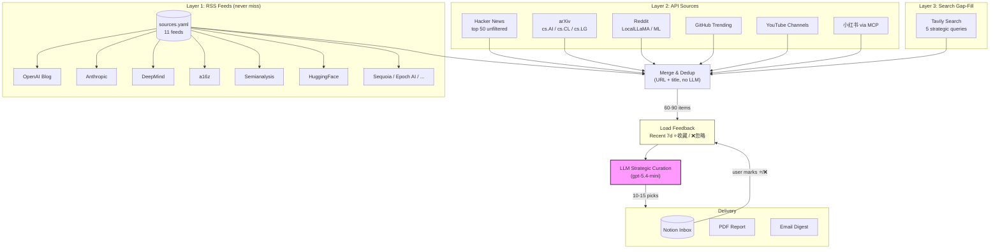
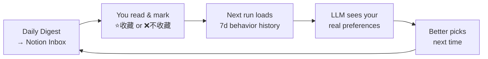
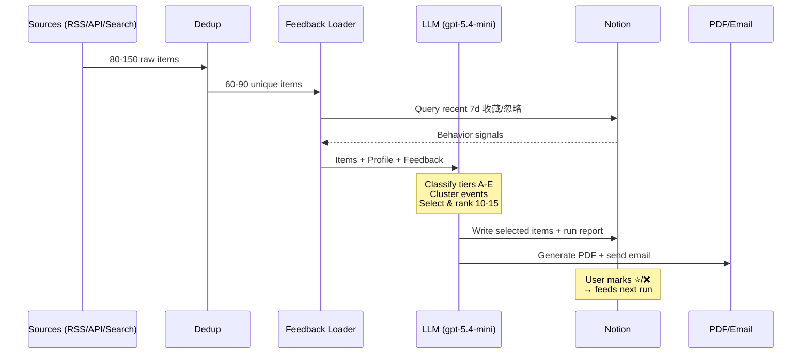

# AI Daily Digest — Strategic Intelligence Pipeline

> A fully automated AI news curation agent that fetches from 10+ sources, classifies by **information tier** (A-E), clusters duplicate events, and delivers a personalized daily brief tuned by your real reading behavior.

```
80-150 items/day → Dedup → LLM Strategic Curation → 10-15 picks → Notion + PDF + Email
```


---

## Architecture



### Information Tier System (replaces numeric scoring)

The LLM doesn't score items 1-10. It classifies each item by **information tier**, then selects based on strategic value:

| Tier | Type | Selection Rule | Example |
|------|------|---------------|---------|
| **A** | First-hand info | Almost always select | CEO blog post, official launch announcement |
| **B** | Deep analysis | Select the best few | a16z strategy report, Semianalysis deep dive |
| **C** | Second-hand reporting | Keep one per event | TechCrunch covering an OpenAI launch |
| **D** | Community discussion | Only if uniquely insightful | Reddit thread with novel perspective |
| **E** | Tutorials / consumer | Almost never select | "How to use ChatGPT for X" |

**Event clustering**: When multiple sources cover the same story, only the highest-tier source is kept.

### Feedback Loop



Your real behavior (not declared interests) calibrates the LLM. The more you use it, the better it gets.

---

## Quick Start

```bash
# 1. Install
pip install -r requirements.txt

# 2. Configure
cp .env.example .env
# Fill in: OPENAI_API_KEY, OPENAI_BASE_URL, NOTION_TOKEN

# 3. Run
python main.py --skip-email

# 4. Output
# → Notion inbox populated
# → output/2026-03-22/report.pdf + data.json
```

### CLI Options

```bash
python main.py                                    # Full pipeline
python main.py --skip-email --skip-notion         # Local only
python main.py --sources hackernews,arxiv,rss     # Specific sources
python main.py --interests "AI Agent, SaaS"       # Override interests
python main.py --cleanup-only                     # Just clean inbox
```

---

## Adding Sources (Zero Code)

### Add an RSS feed

Edit `sources.yaml`:

```yaml
rss:
  - { name: "New Blog", url: "https://example.com/feed.xml", category: "官方一手" }
```

### Add a search query

```yaml
search:
  queries:
    - "AI agent infrastructure startup"
    - "your new query here"
```

### Current sources.yaml

| Source | Type | Category |
|--------|------|----------|
| OpenAI News | RSS | 官方一手 |
| Anthropic News | RSS | 官方一手 |
| Google DeepMind | RSS | 官方一手 |
| Google Research | RSS | 官方一手 |
| Microsoft Research | RSS | 官方一手 |
| HuggingFace Blog | RSS | AI技术社区 |
| a16z | RSS | 投资机构 |
| Semianalysis | RSS | 独立研究 |
| Epoch AI | RSS | 独立研究 |
| Sequoia Capital | RSS | 投资机构 |
| Menlo Ventures | RSS | 投资机构 |
| Hacker News | API | top 50, unfiltered |
| arXiv | API | cs.AI, cs.CL, cs.LG |
| Reddit | API | LocalLLaMA, MachineLearning |
| GitHub Trending | API | Python |
| YouTube | RSS | No Priors, Lex Fridman, ... |
| 小红书 | MCP | via xiaohongshu-mcp |
| Tavily Search | API | 5 strategic queries |

---

## Configuration

### Notion Config Page

The system reads your preferences from a Notion page (auto-synced on each run):

| Section | Purpose |
|---------|---------|
| **筛选视角** | Your perspective (product strategist / investor / founder) |
| **内容优先级** | P1-P4 ranking of content types |
| **排除内容** | What to never include |
| **长期关注课题** | Long-term research topics |
| **指定课题** | One-shot focus override (leave empty to disable) |

### config.json

```json
{
  "pipeline": {
    "llm": {
      "processing_model": "gpt-5.4-mini",
      "summary_model": "gpt-5.4-mini"
    },
    "sources": {
      "hackernews": { "enabled": true, "max_items": 50 },
      "rss": { "enabled": true, "max_items": 50 },
      "tavily": { "enabled": true, "max_per_query": 8 }
    }
  },
  "schedule": {
    "relevance_threshold": 5,
    "max_selected": 25
  }
}
```

---

## Notion Inbox Schema

| Column | Type | Description |
|--------|------|-------------|
| 名称 | Title (linked) | Clickable title → opens original article |
| 来源 | Select | Source category (官方一手 / AI技术社区 / ...) |
| 话题 | Multi-select | LLM-assigned topic |
| 重要性 | Select | 高 / 中 / 低 |
| 入选理由 | Rich text | Why LLM selected this item |
| 摘要 | Rich text | 50-100 char Chinese summary with context |
| 原文链接 | URL | Direct link to source |
| 收录时间 | Date | Collection date |
| 选择 | Select | User marks 收藏 or 不收藏 (feeds back to LLM) |
| 待深度阅读 | Checkbox | Flag for deep reading (strongest feedback signal) |

---

## Pipeline Flow



---

## Project Structure

```
RSS-Notion/
├── main.py                    # Pipeline orchestrator + CLI
├── config.json                # Source/LLM/schedule config
├── sources.yaml               # RSS feeds + search queries (edit this to add sources)
├── .env                       # API keys (not committed)
│
├── sources/                   # Data fetching (no content filtering)
│   ├── base.py                # BaseSource abstract class
│   ├── models.py              # SourceItem, ProcessedItem, PipelineResult
│   ├── rss_fetcher.py         # Generic RSS fetcher (reads sources.yaml)
│   ├── tavily_search.py       # Tavily search gap-filler
│   ├── hackernews.py          # HN top 50 (unfiltered)
│   ├── arxiv_source.py        # arXiv papers
│   ├── reddit.py              # Reddit via PRAW/RSS
│   ├── github_trending.py     # GitHub Trending
│   ├── youtube.py             # YouTube channel RSS
│   ├── xiaohongshu.py         # 小红书 via MCP server
│   ├── producthunt.py         # Product Hunt
│   └── folo.py                # Folo RSS via Notion
│
├── generator/                 # LLM processing
│   ├── interest_scorer.py     # Strategic curation (info-tier + feedback loop)
│   ├── summarizer.py          # Executive summary generation
│   └── pdf_builder.py         # PDF/PNG via Playwright
│
├── delivery/                  # Output
│   ├── notion_writer.py       # Notion write (title=link, 入选理由, dedup)
│   └── emailer.py             # SMTP email with attachments
│
├── templates/                 # PDF report templates
│   ├── daily_report.html
│   └── styles.css
│
└── output/{date}/             # Generated reports
    ├── report.pdf
    ├── report.png
    └── data.json
```

---

## Design Principles

1. **Sources fetch, LLM decides** — No hardcoded keyword filtering. Sources fetch unfiltered content; a single LLM call handles all selection and classification.

2. **Information tier > numeric score** — A first-hand CEO blog post is more valuable than a 9/10 Reddit discussion. The tier system captures this.

3. **Behavior > declared interests** — Your real 收藏/忽略 actions calibrate recommendations better than any keyword list.

4. **Event deduplication** — Same story from 5 sources? Keep the highest-tier source, skip the rest.

5. **One-line source addition** — Adding OpenAI's blog as a source = one line in `sources.yaml`. No Python code needed.

6. **Fault-tolerant** — Any source can fail without blocking the pipeline. LLM failures fall back to minimal items.

---

## Environment Variables

| Variable | Required | Description |
|----------|----------|-------------|
| `OPENAI_API_KEY` | **Yes** | LLM API key |
| `OPENAI_BASE_URL` | No | Custom endpoint (EasyCIL, OneAPI, etc.) |
| `NOTION_TOKEN` | Recommended | Enables Notion read/write + feedback loop |
| `TAVILY_API_KEY` | No | Enables search gap-filling |
| `REDDIT_CLIENT_ID` | No | Reddit OAuth (falls back to RSS) |
| `REDDIT_CLIENT_SECRET` | No | Reddit OAuth |
| `SMTP_HOST` / `SMTP_PORT` | No | Email delivery |
| `SMTP_USER` / `SMTP_PASSWORD` | No | Email auth |

---

## License

MIT
