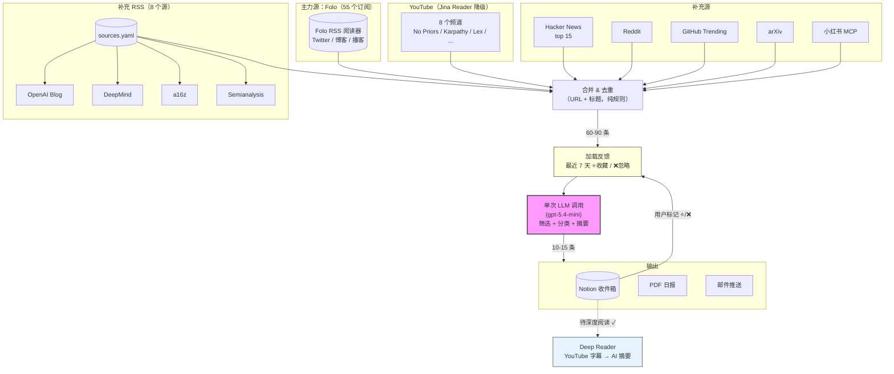
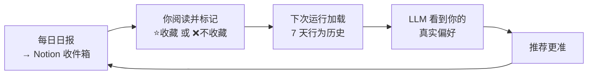

# AI Daily Digest — 每日 AI 认知日报自动化 Agent

> 全自动化的 AI 信息策展系统：从 9 个数据源并发抓取 100+ 条内容，经过**信息增量判断**模型筛选（不打分，只问"读完后认知会变化吗"），生成结构化日报，同步到 Notion 知识库，并支持 YouTube 视频字幕深度摘要。

```
100+ 条/天 → Python 去重 → 单次 LLM 筛选 → 10-15 条精选 → Notion + PDF + 邮件
```


---

## 系统架构



### 信息频道分类

| 频道 | 颜色 | 来源 | 选择规则 |
|------|------|------|---------|
| **一手/官方** | 🔵 蓝 | CEO 博客、官方公告、新闻稿 | 几乎全选 |
| **深度研究** | 🟣 紫 | a16z 报告、Semianalysis、长文分析 | 选最好的几篇 |
| **长内容/播客** | 🟠 橙 | YouTube 视频、播客、长文博客 | 每话题选最佳 |
| **社交/社区/Twitter** | 🟢 绿 | Twitter 推文、Reddit、HN | 有独特见解才选 |
| **开源/技术/论文** | ⚪ 灰 | GitHub 仓库、arXiv 论文 | 重要发布才选 |

### 反馈闭环



用户的真实行为（不是声明的兴趣）校准 LLM。用得越多越准。

---

## 快速开始

```bash
# 1. 安装
pip install -r requirements.txt

# 2. 配置环境变量
cp .env.example .env
# 填入: OPENAI_API_KEY, OPENAI_BASE_URL, NOTION_TOKEN, FOLO_SESSION_TOKEN

# 3. 运行
python main.py --skip-email

# 4. 查看产出
# → Notion 收件箱已填充
# → output/2026-03-23/report.pdf + data.json
```

### 命令行选项

```bash
python main.py                                    # 完整管线（2 次 LLM 调用）
python main.py --skip-email --skip-notion         # 仅本地输出
python main.py --sources hackernews,arxiv,rss     # 指定数据源
python main.py --interests "AI Agent, SaaS"       # 覆盖兴趣配置
python main.py --cleanup-only                     # 仅清理收件箱
python main.py --deep-read-only                   # 仅运行 Deep Reader
```

---

## Deep Reader：YouTube 字幕深度摘要

对 Notion 中的 YouTube 页面勾选「待深度阅读」→ 自动抓取字幕 → LLM 生成战略摘要 → 写回页面。

### 工作流程

1. 在 Notion 收件箱中对任意 YouTube 视频勾选 **待深度阅读**
2. Deep Reader 获取视频字幕（中文 → 英文 → 自动生成，按顺序尝试）
3. LLM 生成结构化摘要（核心观点 + 战略含义 + 关键引用 + 值得追踪的信号）
4. 摘要以结构化 blocks 写回 Notion 页面

### 三种触发方式

| 方式 | 命令 | 适用场景 |
|------|------|---------|
| **Pipeline 内置** | `python main.py` | 每次跑日报时自动处理（Phase 7） |
| **CLI** | `python main.py --deep-read-only` | 按需处理待读页面 |
| **Webhook** | `POST /api/webhook/deep-read` | Notion Automation 实时触发 |

### Webhook 设置

```bash
# 1. 启动 API 服务
python -m api.server          # → http://localhost:8001

# 2. 暴露公网
ngrok http 8001               # → https://xxxx.ngrok-free.dev

# 3. Notion 自动化
# 触发器: 待深度阅读 checkbox 变更
# 动作: 发送 webhook → POST https://xxxx.ngrok-free.dev/api/webhook/deep-read
```

---

## 添加数据源（零代码）

**方式 1：Folo app（推荐）**
打开 [follow.is](https://follow.is)，搜索并关注新的 RSS/Twitter/YouTube → 下次 pipeline 自动拉取

**方式 2：sources.yaml**
```yaml
rss:
  - { name: "新博客", url: "https://example.com/feed.xml", category: "官方一手" }
```

### 当前数据源

| 数据源 | 类型 | 内容 | 条数 |
|--------|------|------|------|
| **Folo API** | 主力 | 55 个订阅（Twitter 13 人 + 博客 20+ + 播客 + 中文源） | 60 |
| RSS 订阅 | 补充 | OpenAI/DeepMind/a16z/Semianalysis 等 | 30 |
| YouTube | 补充 | No Priors/Karpathy/Lex/Fireship/All-In 等 8 频道 | 15 |
| Hacker News | 补充 | Top 15 全量，不做关键词过滤 | 15 |
| Reddit | 补充 | r/LocalLLaMA + r/MachineLearning | 10 |
| GitHub Trending | 补充 | Python 热门仓库 | 10 |
| arXiv | 补充 | cs.AI / cs.CL / cs.LG | 10 |
| 小红书 | 可选 | 通过 xiaohongshu-mcp 搜索 | 10 |

---

## Notion 配置

### 配置页面（自动同步）

| 章节 | 用途 |
|------|------|
| **筛选视角** | 你的角色定位（产品人/投资人/创业者） |
| **内容优先级** | P1-P4 内容类型排序 |
| **排除内容** | 永远不选的内容类型 |
| **长期关注课题** | 长期研究方向 |
| **指定课题** | 临时关注（留空不启用） |

### Notion 收件箱字段

| 字段 | 类型 | 说明 |
|------|------|------|
| 名称 | 标题（带链接） | 点击直接跳转原文 |
| 来源 | Select | 频道分类（一手/深度研究/长内容/社交/开源） |
| 重要性 | Select | 高 / 中 / 低 |
| 入选理由 | 文本 | LLM 为什么选了这条 |
| 摘要 | 文本 | what_happened — 谁做了什么，关键数字（中文） |
| 洞察 | 文本 | why_it_matters — 改变了什么判断（中文） |
| 选择 | Select | 用户标记收藏/不收藏（反馈给 LLM） |
| 待深度阅读 | Checkbox | 触发 Deep Reader |

---

## 处理流程


**每次运行 2 次 LLM 调用**（之前是 8 次）：1 次筛选 + 1 次趋势摘要。Deep Reader 按需额外调用。

---

## 项目结构

```
RSS-Notion/
├── main.py                    # 管线编排 + CLI 入口
├── config.json                # 数据源/LLM/调度配置
├── sources.yaml               # 补充 RSS 源（改这里加新源）
├── .env                       # API 密钥（不提交）
│
├── sources/                   # 数据抓取（不做内容过滤）
│   ├── base.py                # BaseSource 抽象基类
│   ├── models.py              # 数据模型
│   ├── folo.py                # Folo RSS 阅读器（主力源，55 订阅）
│   ├── rss_fetcher.py         # 通用 RSS 抓取（读 sources.yaml）
│   ├── youtube.py             # YouTube（Jina Reader 降级）
│   ├── hackernews.py          # HN 热帖
│   ├── arxiv_source.py        # arXiv 论文
│   ├── reddit.py              # Reddit
│   ├── github_trending.py     # GitHub Trending
│   └── xiaohongshu.py         # 小红书 via MCP
│
├── generator/                 # LLM 处理
│   ├── interest_scorer.py     # 信息增量筛选 + 反馈闭环
│   ├── deep_reader.py         # YouTube 字幕 → AI 深度摘要
│   ├── summarizer.py          # 趋势观察生成
│   └── pdf_builder.py         # PDF/PNG 渲染
│
├── delivery/                  # 输出
│   ├── notion_writer.py       # Notion 写入（标题链接 + 摘要 + 洞察）
│   └── emailer.py             # SMTP 邮件
│
├── api/                       # Web 服务 + Webhook
│   └── server.py              # FastAPI（触发/报告/Deep Reader webhook）
│
├── templates/                 # PDF 报告模板
│   ├── daily_report.html
│   └── styles.css
│
└── output/{date}/             # 生成的报告
    ├── report.pdf
    ├── report.png
    └── data.json
```

---

## 设计原则

1. **源只管抓，LLM 只用一次** — 不做硬编码关键词过滤，单次 LLM 调用完成所有筛选和分类
2. **信息增量 > 数字评分** — 每条入选内容必须告诉读者一个昨天不知道的事实或判断
3. **行为 > 声明** — 用户的收藏/忽略操作比任何关键词列表都更准确
4. **事件去重** — 同一件事 5 个源报道？只保留信息量最大的那条
5. **最少 LLM 调用** — 每次运行 2 次（筛选 + 摘要），Deep Reader 按需额外 1 次
6. **容错优先** — 任何单源失败不阻塞整体管线

---

## 4 次关键迭代

| 版本 | 做法 | 发现的问题 | 决策 |
|------|------|-----------|------|
| V1 | 30+ 关键词正则过滤 | "token"匹配到币圈，新话题需手动加词 | 删掉源端过滤，全量进 LLM |
| V2 | 信息层级 A-E 分类 | Elon 转推=A 类，36kr 水资源=C 类，按身份不按内容 | 改为信息增量判断 |
| V3 | 两个问题：有增量吗？跟战略有关吗？ | 有效，但 7 批×15 条 = 8 次 LLM 调用太多 | 压缩到单次全量 |
| V4 | 单次调用 + 精简输出字段 | 当前版本 | 2 次调用，50 秒完成 |

---

## 环境变量

| 变量 | 必需 | 说明 |
|------|------|------|
| `OPENAI_API_KEY` | **是** | LLM API 密钥 |
| `OPENAI_BASE_URL` | 否 | 自定义端点（EasyCIL 等代理） |
| `NOTION_TOKEN` | 推荐 | 启用 Notion 读写 + 反馈闭环 |
| `FOLO_SESSION_TOKEN` | 推荐 | Folo RSS 阅读器 session token |
| `REDDIT_CLIENT_ID` | 否 | Reddit OAuth（无则降级 RSS） |
| `SMTP_HOST` / `SMTP_PORT` | 否 | 邮件发送 |

---

## License

MIT
