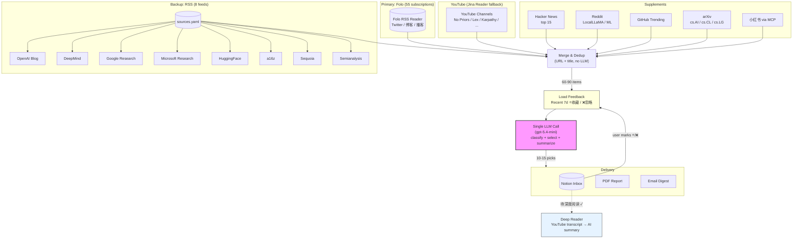
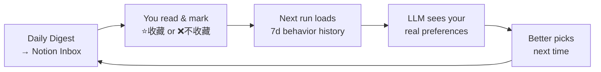
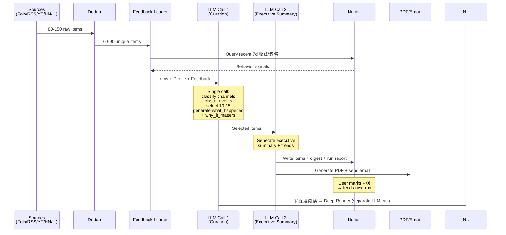

# AI Daily Digest — Strategic Intelligence Pipeline

> A fully automated AI news curation agent that fetches from 10+ sources, generates **information increments** (what_happened / why_it_matters) for each pick, clusters duplicate events, and delivers a personalized daily brief tuned by your real reading behavior.

```
80-150 items/day → Dedup → Single LLM Curation Call → 10-15 picks → Notion + PDF + Email
```


---

## Architecture



### Channel System (信息频道)

The LLM classifies each item into a **channel** based on source type, then selects based on information increment value:

| Channel | Color | Sources | Selection Rule |
|---------|-------|---------|---------------|
| **一手/官方** | 🔵 blue | CEO blog posts, official launches, press releases | Almost always select |
| **深度研究** | 🟣 purple | a16z reports, Semianalysis, long-form analysis | Select the best few |
| **长内容/播客** | 🟠 orange | YouTube videos, podcasts, long blog posts | Best per topic |
| **社交/社区/Twitter** | 🟢 green | Twitter threads, Reddit, Hacker News | Only if uniquely insightful |
| **开源/技术/论文** | ⚪ gray | GitHub repos, arXiv papers | Notable releases only |

**Event clustering**: When multiple sources cover the same story, only the highest-value source is kept.

### Feedback Loop



Your real behavior (not declared interests) calibrates the LLM. The more you use it, the better it gets.

---

## Quick Start

```bash
# 1. Install
pip install -r requirements.txt

# 2. Configure
cp .env.example .env
# Fill in: OPENAI_API_KEY, OPENAI_BASE_URL, NOTION_TOKEN, FOLO_SESSION_TOKEN

# 3. Run
python main.py --skip-email

# 4. Output
# → Notion inbox populated
# → output/2026-03-23/report.pdf + data.json
```

### CLI Options

```bash
python main.py                                    # Full pipeline
python main.py --skip-email --skip-notion         # Local only
python main.py --sources hackernews,arxiv,rss     # Specific sources
python main.py --interests "AI Agent, SaaS"       # Override interests
python main.py --cleanup-only                     # Just clean inbox
python main.py --deep-read-only                   # Just run Deep Reader
```

---

## Deep Reader

Automatic YouTube transcript extraction + AI strategic summary, triggered from Notion.

### How It Works

1. Check **待深度阅读** on any YouTube page in your Notion inbox
2. Deep Reader fetches the video transcript (zh → en → auto-generated)
3. LLM generates a structured summary (core arguments, strategic implications, key quotes)
4. Summary is written back to the Notion page as structured blocks

### Three Ways to Trigger

| Method | Command | When to Use |
|--------|---------|-------------|
| **Pipeline** | `python main.py` | Runs automatically as Phase 7 |
| **CLI** | `python main.py --deep-read-only` | Process pending pages on demand |
| **Webhook** | `POST /api/webhook/deep-read` | Real-time via Notion Automation |

### Webhook Setup (Real-time)

```bash
# 1. Start the API server
python -m api.server          # → http://localhost:8000

# 2. Expose via ngrok
ngrok http 8000               # → https://xxxx.ngrok.io

# 3. Notion Automation
# Trigger: 待深度阅读 checkbox changed
# Action: Send webhook → POST https://xxxx.ngrok.io/api/webhook/deep-read
```

---

## Adding Sources (Zero Code)

### Add an RSS feed

Edit `sources.yaml`:

```yaml
rss:
  - { name: "New Blog", url: "https://example.com/feed.xml", category: "官方一手" }
```

### Current sources.yaml

| Source | Type | Category |
|--------|------|----------|
| OpenAI News | RSS | 官方一手 |
| Google DeepMind | RSS | 官方一手 |
| Google Research | RSS | 官方一手 |
| Microsoft Research | RSS | 官方一手 |
| HuggingFace Blog | RSS | AI技术社区 |
| a16z Future | RSS | 投资机构 |
| Sequoia Capital | RSS | 投资机构 |
| Semianalysis | RSS | 独立研究 |
| Folo | API | 55 subscriptions (Twitter/博客/播客) |
| YouTube | RSS+Jina | No Priors, Lex Fridman, Karpathy, ... |
| Hacker News | API | top 15 |
| arXiv | API | cs.AI, cs.CL, cs.LG |
| Reddit | API | LocalLLaMA, MachineLearning |
| GitHub Trending | API | Python |
| 小红书 | MCP | via xiaohongshu-mcp |

---

## Configuration

### Notion Config Page

The system reads your preferences from a Notion page (auto-synced on each run):

| Section | Purpose |
|---------|---------|
| **筛选视角** | Your perspective (product strategist / investor / founder) |
| **内容优先级** | P1-P4 ranking of content types |
| **排除内容** | What to never include |
| **长期关注课题** | Long-term research topics |
| **指定课题** | One-shot focus override (leave empty to disable) |

### config.json

```json
{
  "pipeline": {
    "llm": {
      "processing_model": "gpt-5.4-mini",
      "summary_model": "gpt-5.4-mini"
    },
    "sources": {
      "folo": { "enabled": true, "max_items": 60 },
      "rss": { "enabled": true, "max_items": 30 },
      "hackernews": { "enabled": true, "max_items": 15 },
      "youtube": { "enabled": true, "max_items": 15 }
    }
  },
  "schedule": {
    "relevance_threshold": 5,
    "max_selected": 25
  }
}
```

---

## Notion Inbox Schema

| Column | Type | Description |
|--------|------|-------------|
| 名称 | Title (linked) | Clickable title → opens original article |
| 来源 | Select | Channel (一手/官方 / 深度研究 / 长内容/播客 / 社交/社区/Twitter / 开源/技术/论文) |
| 重要性 | Select | 高 / 中 / 低 |
| 入选理由 | Rich text | Why LLM selected this item |
| 摘要 | Rich text | What happened — facts, numbers, who did what (Chinese) |
| 洞察 | Rich text | Why it matters — judgment, implications, trend confirmation (Chinese) |
| 媒体来源 | Rich text | Original source name (e.g. "Folo", "YouTube") |
| 原文链接 | URL | Direct link to source |
| 收录时间 | Date | Collection date |
| 选择 | Select | User marks 收藏 or 不收藏 (feeds back to LLM) |
| 待深度阅读 | Checkbox | Triggers Deep Reader for YouTube pages |

---

## Pipeline Flow



**2 LLM calls per run** (was 8): one curation call handles all scoring/classification/summarization, plus one executive summary call.

---

## Project Structure

```
RSS-Notion/
├── main.py                    # Pipeline orchestrator + CLI
├── config.json                # Source/LLM/schedule config
├── sources.yaml               # Backup RSS feeds (edit this to add sources)
├── .env                       # API keys (not committed)
│
├── sources/                   # Data fetching (no content filtering)
│   ├── base.py                # BaseSource abstract class
│   ├── models.py              # SourceItem, ProcessedItem, PipelineResult
│   ├── folo.py                # Folo RSS reader (primary source, 55 subs)
│   ├── rss_fetcher.py         # Generic RSS fetcher (reads sources.yaml)
│   ├── youtube.py             # YouTube channel RSS (Jina Reader fallback)
│   ├── hackernews.py          # HN top stories
│   ├── arxiv_source.py        # arXiv papers
│   ├── reddit.py              # Reddit via PRAW/RSS
│   ├── github_trending.py     # GitHub Trending
│   ├── xiaohongshu.py         # 小红书 via MCP server
│   ├── producthunt.py         # Product Hunt (disabled)
│   └── tavily_search.py       # Tavily search (disabled)
│
├── generator/                 # LLM processing
│   ├── interest_scorer.py     # Strategic curation (channel + feedback loop)
│   ├── deep_reader.py         # YouTube transcript → AI deep summary
│   ├── summarizer.py          # Executive summary generation
│   └── pdf_builder.py         # PDF/PNG via Playwright
│
├── delivery/                  # Output
│   ├── notion_writer.py       # Notion write (title=link, 摘要, 洞察, dedup)
│   └── emailer.py             # SMTP email with attachments
│
├── api/                       # Web server + webhooks
│   ├── server.py              # FastAPI server (trigger, reports, deep-read webhook)
│   └── webhook.py             # Deep Reader polling watcher (standalone)
│
├── templates/                 # PDF report templates
│   ├── daily_report.html
│   └── styles.css
│
└── output/{date}/             # Generated reports
    ├── report.pdf
    ├── report.png
    └── data.json
```

---

## Design Principles

1. **Sources fetch, LLM decides** — No hardcoded keyword filtering. Sources fetch unfiltered content; a single LLM call handles all selection and classification.

2. **Information increment > numeric score** — Every pick must tell the reader something they didn't know yesterday. `what_happened` captures facts; `why_it_matters` captures judgment.

3. **Behavior > declared interests** — Your real 收藏/忽略 actions calibrate recommendations better than any keyword list.

4. **Event deduplication** — Same story from 5 sources? Keep the highest-value source, skip the rest.

5. **Minimal LLM calls** — 2 calls per run (curation + summary). Deep Reader adds 1 call per YouTube page on demand.

6. **Fault-tolerant** — Any source can fail without blocking the pipeline. LLM failures fall back to minimal items.

---

## Environment Variables

| Variable | Required | Description |
|----------|----------|-------------|
| `OPENAI_API_KEY` | **Yes** | LLM API key |
| `OPENAI_BASE_URL` | No | Custom endpoint (EasyCIL, OneAPI, etc.) |
| `NOTION_TOKEN` | Recommended | Enables Notion read/write + feedback loop |
| `FOLO_SESSION_TOKEN` | Recommended | Folo RSS reader session token |
| `REDDIT_CLIENT_ID` | No | Reddit OAuth (falls back to RSS) |
| `REDDIT_CLIENT_SECRET` | No | Reddit OAuth |
| `SMTP_HOST` / `SMTP_PORT` | No | Email delivery |
| `SMTP_USER` / `SMTP_PASSWORD` | No | Email auth |

---

## License

MIT
